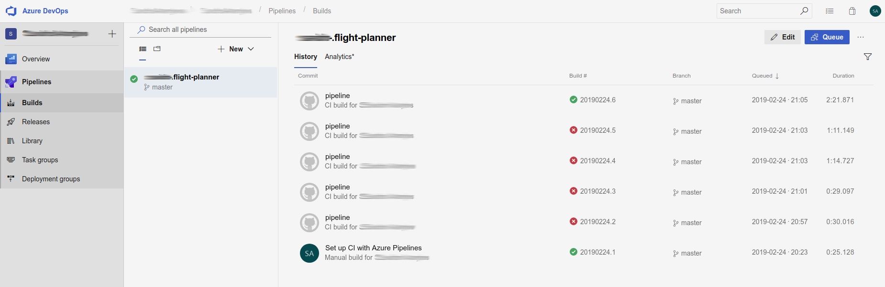

# JavaScript Exercises

## Getting started

1. Create a new repository in your github account called `javascript-exercises`

2. Clone this project:

`git clone https://github.com/codelex-io/javascript-exercises`

3. Change project origin to your repository:

`git remote set-url origin https://github.com/{username}/javascript-exercises.git`

4. Push changes:

`git push`

5. Pull dependencies:

`npm install`

## Setup automated build for each pull request

Each pull request must be validated to ensure that all tests are passing and the code is properly formatted.

Visit [Azure pipelines @github.com/marketplace](https://github.com/marketplace/azure-pipelines) and complete free plan setup for your repository.

From now on each pull request you make will be built automatically, you can follow the progress at [dev.azure.com](https://dev.azure.com)

## Executing tests

To execute all tests:

`npm run test`

To execute a single test:

`npm run test exercises/easy/Anagrams`

## Submit an assignment

Before submitting any of the assignments, create a new branch with appropriate name:

`git checkout -b {branch-name}`

When all of the needed tests are passing, push the changes and create a pull request to your teacher:

`git push origin {branch-name}`

### Easy (branch name: easy)
