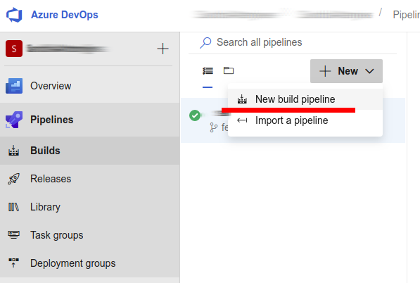
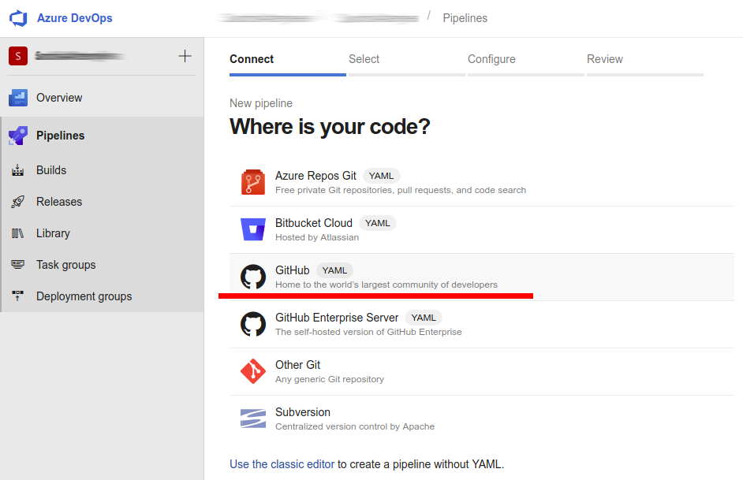
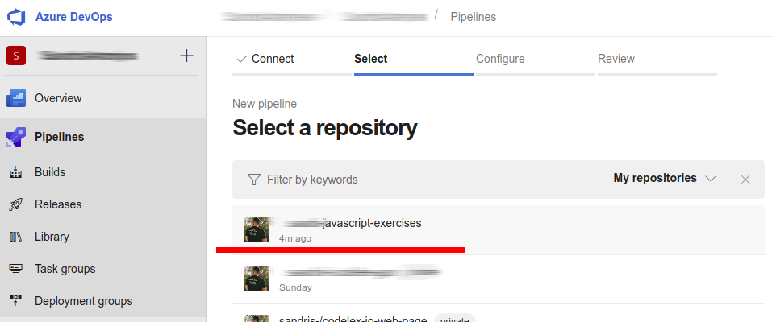
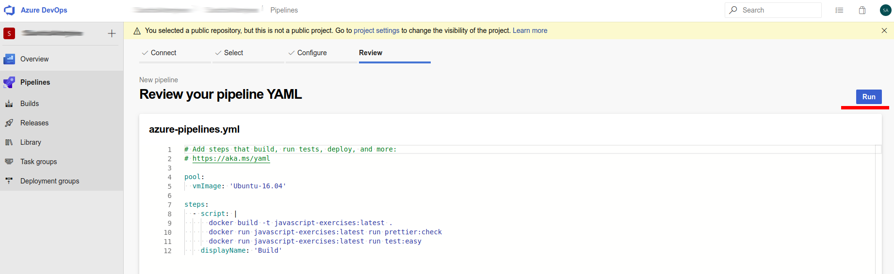
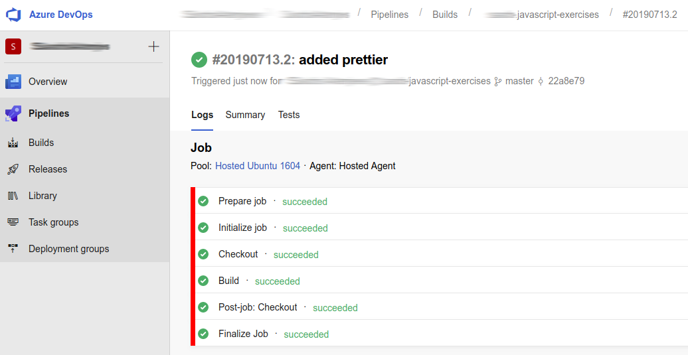

# JavaScript Exercises

## Getting started

1. Create a new repository in your github account called `javascript-exercises`

2. Clone this project:

`git clone https://github.com/codelex-io/javascript-exercises`

3. Change project origin to your repository:

`git remote set-url origin https://github.com/{username}/javascript-exercises.git`

4. Push changes:

`git push -u origin master`

5. Pull dependencies:

`npm install`

## Setup automated build for each pull request

Each pull request must be validated to ensure that all tests are passing and the code is properly formatted.

Visit [*Azure pipelines* @github.com/marketplace](https://github.com/marketplace/azure-pipelines) and complete free plan setup for your repository.

When you will have an account created there, you may access *Azure Pipelines*

### Setup pipeline for your repository

1. Create new pipeline

2. Choose GitHub YAML

3. Select repository

4. Review yaml file & run your automated build 

4. Wait till build is successful 

## Executing tests

To execute all tests:

`npm run test`

To execute a single test:

`npm run test exercises/easy/Anagrams`

## Submit an assignment

Before submitting any of the assignments, create a new branch with appropriate name:

`git checkout -b {branch-name}`

When all of the needed tests are passing, push the changes and create a pull request to your teacher:

`git push origin {branch-name}`

### Easy (branch name: easy)

In the [azure-pipelines.yml](./azure-pipelines.yml) which is located in the root of your repository, make sure that third line under *script* is uncommented and contains following command:

`docker run javascript-exercises:latest run test:easy`

# How to learn?

## [w3schools.com](https://www.w3schools.com/js/default.asp)

Main things you will need to understand to complete most of these exercises are:

 - [Variables](https://www.w3schools.com/js/js_variables.asp)
 - [Data Types](https://www.w3schools.com/js/js_datatypes.asp)
 - [Functions](https://www.w3schools.com/js/js_functions.asp)
 - [Objects](https://www.w3schools.com/js/js_objects.asp)
 - [Strings](https://www.w3schools.com/js/js_strings.asp)
 - [String Methods](https://www.w3schools.com/js/js_string_methods.asp)
 - [Arrays](https://www.w3schools.com/js/js_arrays.asp)
 - [Array Methods](https://www.w3schools.com/js/js_array_methods.asp)
 - [Array Iteration](https://www.w3schools.com/js/js_array_iteration.asp)
 - [Conditions](https://www.w3schools.com/js/js_if_else.asp)

## [JavaScript for beginners ~3h video @youtube.com](https://www.youtube.com/watch?v=PkZNo7MFNFg)

## [The Net Ninja @youtube.com](https://www.youtube.com/channel/UCW5YeuERMmlnqo4oq8vwUpg)

If you are still struggling with the basic concepts, go through the [JavaScript Tutorials for Beginners](https://www.youtube.com/playlist?list=PL4cUxeGkcC9i9Ae2D9Ee1RvylH38dKuET)

Especially helpful for these exercises will be:

 - [If Statements](https://www.youtube.com/watch?v=Lp-Du2fKoug)
 - [While Loops](https://www.youtube.com/watch?v=PpbFyLTtpWI)
 - [For Loops](https://www.youtube.com/watch?v=U87UmD-5h4o)
 - [Loops - Practical Example](https://www.youtube.com/watch?v=eZBTLsv2ktM)
 - [Functions](https://www.youtube.com/watch?v=KH57lIgwe2g)
 - [Strings](https://www.youtube.com/watch?v=k8MIbEVXhE0)
 - [Slice & Split Strings](https://www.youtube.com/watch?v=HEdikBHsMag)
 - [Arrays](https://www.youtube.com/watch?v=EUnV-fCY0Pc)
 - [Introduction to Objects](https://www.youtube.com/watch?v=t-evBCCQFzM)
 - [Creating a new Object](https://www.youtube.com/watch?v=wA5vU_HQfVI)

## [You Dont Know JS: Up & Going](https://github.com/getify/You-Dont-Know-JS/blob/master/up%20&%20going/README.md#you-dont-know-js-up--going)

Read this book to better understand basic concepts of programming and JavaScript.